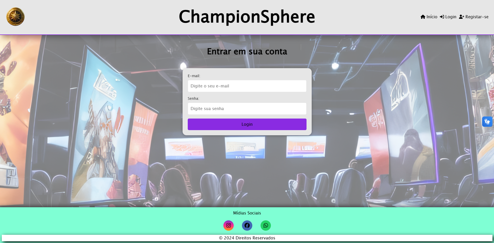
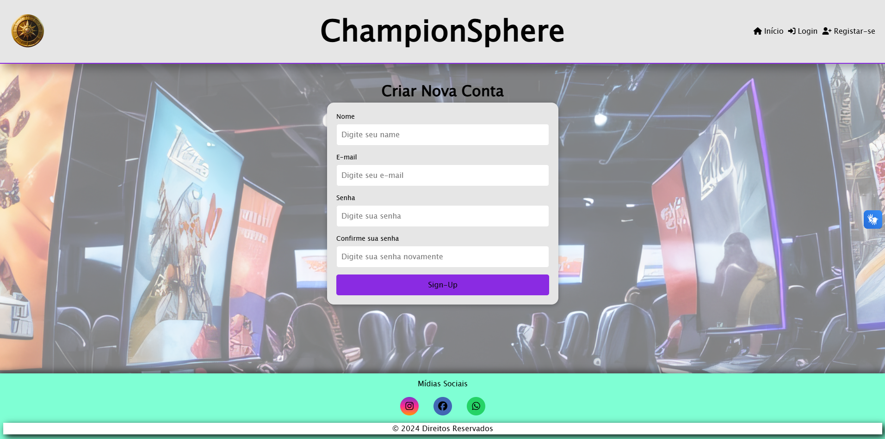
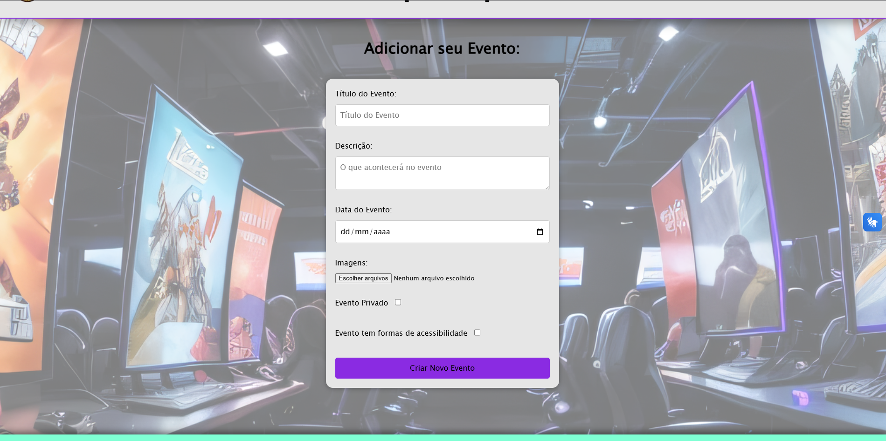
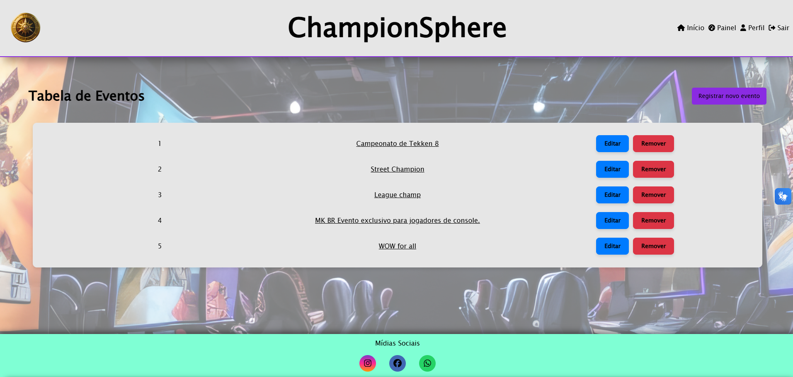
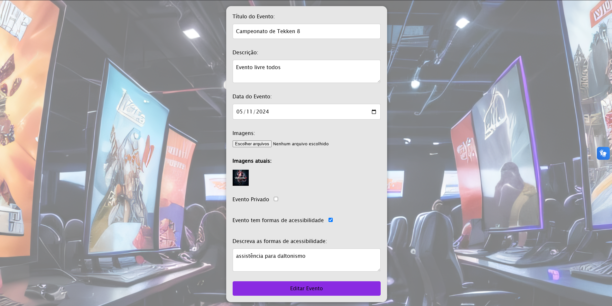
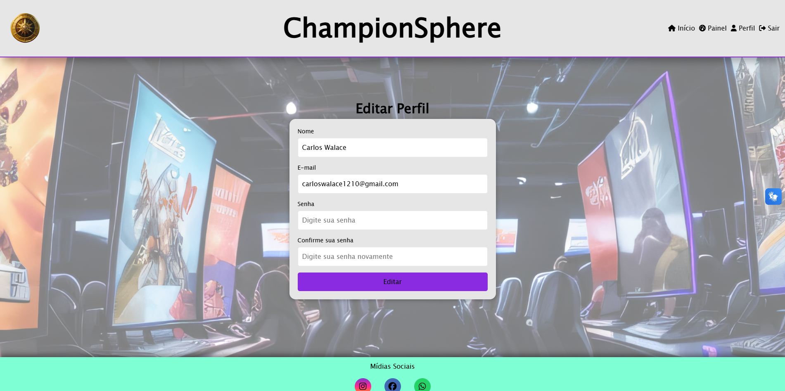
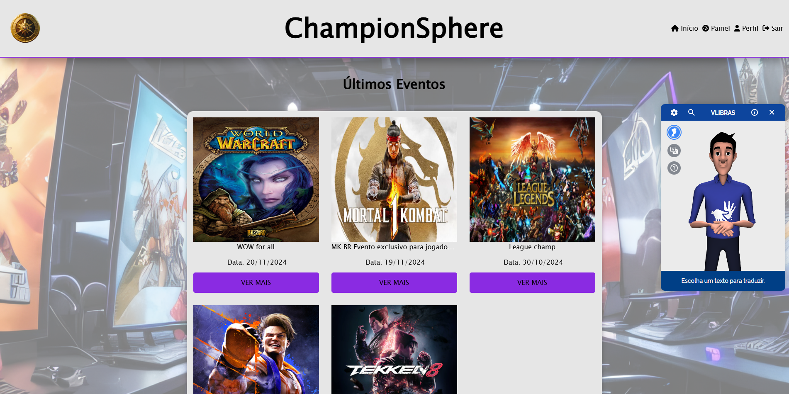

# 🎮 Plataforma Inclusiva de Eventos de eSports

> Uma plataforma para cadastro e gestão de eventos de eSports com foco na **inclusão de pessoas com deficiências sensoriais**.

---

## 🧠 Visão Geral

Esta aplicação promove a inclusão de pessoas com deficiências visuais e auditivas no cenário dos esportes eletrônicos. A plataforma permite o cadastro, gerenciamento e visualização de eventos de forma acessível e intuitiva.

---

## 🖼️ Capturas de Tela

### 🔐 Login

### 📝 Criação de Conta

### ➕ Criação de um Novo Evento

### 🎛️ Painel de Eventos

### ✏️ Edição de Evento

### 🙋‍♂️ Edição de Perfil

### 🧏‍♂️ V-LIBRAS em Funcionamento

---

## 🚀 Funcionalidades

- Cadastro de usuários com autenticação JWT
- Criação, edição e exclusão de eventos
- Interface responsiva e acessível
- Integração com V-LIBRAS
- Testes de acessibilidade com Axe-core e ARC Toolkit

---

## 🛠️ Tecnologias Utilizadas

- **Frontend**: Vue.js
- **Backend**: Node.js, Express, MongoDB, Mongoose
- **Acessibilidade**: Axe-core, ARC Toolkit, V-LIBRAS
- **Autenticação**: JWT

---

## 🧭 Como Funciona

1. O usuário acessa os eventos públicos logo na tela inicial.
2. Pode criar sua conta, fazer login e começar a cadastrar seus próprios eventos.
3. Cada evento pode ser público ou privado.
4. Há uma dashboard com gerenciamento completo de eventos e dados do perfil.

---

## 📦 Como Rodar o Projeto

1. Clone o repositório
bashgit clone https://github.com/CarlosWalace/ChampionSphere.git
cd ChampionSphere
2. Configure as variáveis de ambiente
Dentro da pasta backend/, crie um arquivo .env com base no exemplo abaixo:
envPORT=3000
MONGO_URI=mongodb://localhost:27017/championsphere
JWT_SECRET=sua_chave_secreta_aqui

⚠️ Substitua MONGO_URI pela sua string de conexão do MongoDB Atlas, se preferir usar a nuvem.

3. Rodando o Backend
bashcd backend
npm install
npm start
O servidor estará disponível em: http://localhost:3000

4. Rodando o Frontend
Abra um novo terminal e execute:
bashcd frontend
npm install
npm start
A aplicação estará disponível em: http://localhost:8080

---

## ♿ Acessibilidade

O projeto foi desenvolvido com foco em inclusão digital:

V-LIBRAS: Widget integrado para tradução de conteúdo em Língua Brasileira de Sinais (LIBRAS).
Axe-core: Testes automatizados de acessibilidade durante o desenvolvimento.
ARC Toolkit: Auditoria e validação de conformidade com as diretrizes WCAG.

---

## 👨‍💻 Autor

**Carlos Walace Cordeiro Rodrigues**  
Aluno de Ciência da Computação – PUC Minas  
📧 carloswalace1210@gmail.com 

---

## 📝 Projeto Acadêmico

Trabalho de conclusão com ênfase em **acessibilidade digital** e **inclusão em plataformas web**.
